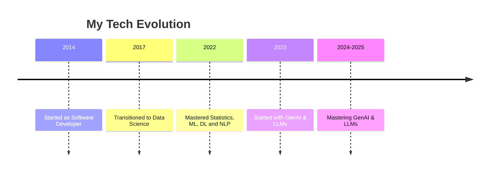
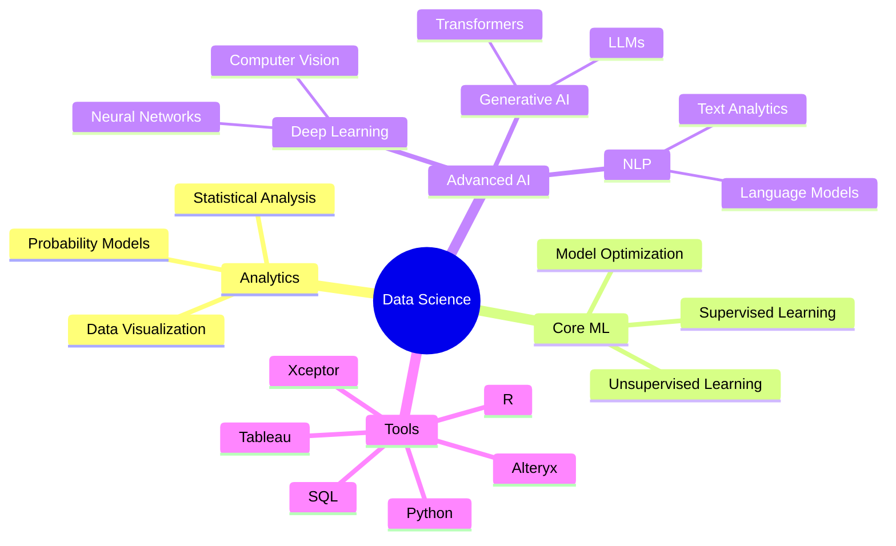

## 👋 Hi there! I'm Nikhil 

## Transforming data into insights | Data Scientist

#### With over a decade of professional experience, I've evolved from a software developer into a seasoned data scientist, passionate about turning complex data challenges into actionable insights.

### 🚀 Professional Journey

### 💡 What I Do

🔬 Design and implement end-to-end machine learning solutions  
📊 Transform raw data into compelling visual stories 
🤖 Develop NLP and deep learning models 
🎯 Drive data-driven decision making 
🌟 Explore cutting-edge AI technologies 

  

  
  ### Core Skills
  
  
  
  
  
  
  ### Languages & Tools
  
  
  
  
  

  <!-- Your header section with typing animation -->

# 🚀 Quick Facts

In data science, 80% of the effort is spent on data preparation, while the remaining 20% is spent on complaining about data preparation.

🔬 Current Role: Associate Vice President  
🎯 Expertise: Machine Learning, NLP, Deep Learning & GenAI  
💼 Experience: 10+ Years in Technology  
🌱 Evolution: Software Developer (3 years) ➜ Data Scientist (7 years)  
🎓 Core Strength: Statistics, ML, Python, SQL and NLP Algorithms  
🚀 Passion: Building Intelligent Systems & Data Solutions  

# 💡 My Data Science Arsenal

